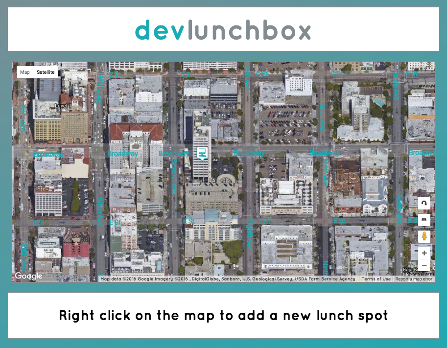

_(In progress)_

This is a one-page Sinatra app.  Its purpose is to hold a list of lunch spots around the DBC campus that students can peruse and/or add to.

To view the app, first make a local clone of the repo, run `bundle install`, and then `shotgun config.ru` to run a local server, which can be accessed through the browser at 'localhost:9393'.

Screenshot of the app

